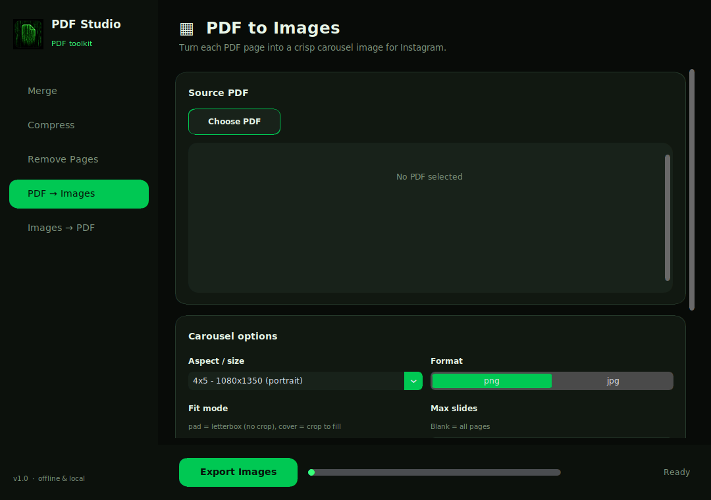

<div align="center">


# PDF Studio

Offline PDF toolkit — your files stay on your computer.

**Merge · Compress · Strip metadata · Remove pages · PDF ↔ images**



</div>

## Windows (easiest)

1. Go to [**Releases**](https://github.com/Metaphysicist1/pdf-processor/releases)
2. Download **`PDFStudio.exe`**
3. Double-click

No Python. No install. No terminal.

If Windows says “protected your PC” → **More info** → **Run anyway**.

No release yet? [**Actions**](https://github.com/Metaphysicist1/pdf-processor/actions) → latest **Build Windows EXE** → download artifact **`PDFStudio-windows`**.

## Linux / Mac / from source

```bash
./scripts/install.sh
./run.sh
```

Windows (with Python installed): double-click `scripts\install.bat`, then `run.bat`.

## What it does

| | |
| --- | --- |
| **Merge** | Combine PDFs |
| **Compress** | Make PDFs smaller |
| **Strip Metadata** | Remove author / title / timestamps |
| **Remove Pages** | Delete selected pages |
| **PDF → Images** | Instagram carousel slides |
| **Images → PDF** | LinkedIn document PDF |

## CLI (optional)

```bash
python -m pdfstudio.carousel split input.pdf -o slides/
python -m pdfstudio.carousel build slides/ -o out.pdf
```
