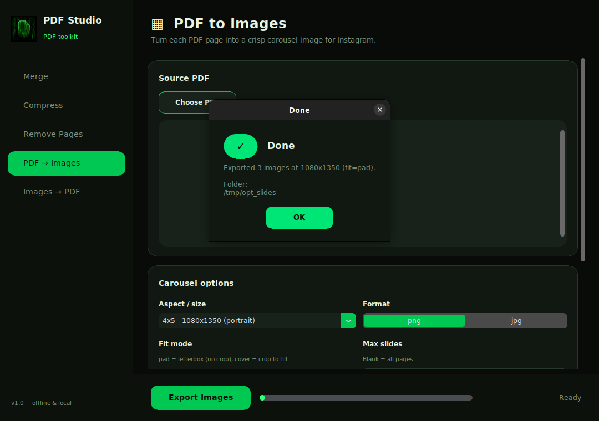
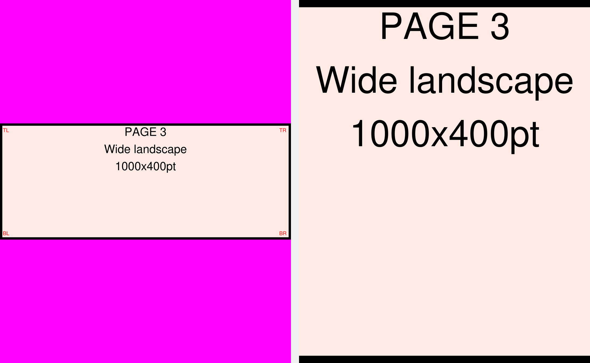

<div align="center">


# PDF Studio

**A modern, offline desktop toolkit for everyday PDF work — plus a scriptable CLI.**

Merge · Compress · Remove pages · PDF → carousel images · Images → PDF

</div>

---

PDF Studio is a small, dependency-light Python project. Everything runs **locally and
offline** — your documents never leave your machine. It ships two ways to use it:

- **A desktop app** (`app.py`) with a Matrix-inspired dark UI, native file dialogs,
  drag-to-reorder file lists, in-app themed result dialogs, and a live progress bar.
- **A command-line tool** (`carousel.py`) for the social-media image workflows, ideal
  for scripting and automation.

<div align="center">

<br/>

</div>

## Features

| Tool | What it does |
| --- | --- |
| **Merge** | Combine several PDFs into one. Reorder them before exporting. |
| **Compress** | Shrink a PDF by recompressing images (adjustable quality) and content streams. |
| **Remove Pages** | Delete specific pages (e.g. `2, 5, 9`) and keep the rest. |
| **PDF → Images** | Rasterize each page into crisp carousel images for Instagram (4:5, 1:1, 9:16), with `pad` (letterbox) or `cover` (crop-to-fill), sRGB conversion, PNG/JPG. |
| **Images → PDF** | Combine images into a single PDF, ready for a LinkedIn document post. |

The carousel renderer renders each page at ≥ 3× the target width and downsamples with
Lanczos (never upscales), converts CMYK/ICC sources to sRGB explicitly, and letterboxes
using either a chosen color or the page's auto-sampled corner color.

<div align="center">

<br/><em>Left: <code>pad</code> letterboxes with no content loss. Right: <code>cover</code> crops to fill without squashing.</em>
</div>

## Install

Requires **Python 3.10+**.

```bash
python -m venv .venv
source .venv/bin/activate          # Windows: .venv\Scripts\activate
pip install -r requirements.txt
```

Dependencies: [`pymupdf`](https://pymupdf.readthedocs.io) (rasterization),
[`Pillow`](https://python-pillow.org) (imaging), [`pypdf`](https://pypdf.readthedocs.io)
(merge/compress/remove), and [`customtkinter`](https://customtkinter.tomschimansky.com)
(the desktop UI). No poppler, ImageMagick, or other system binaries required.

## Run the desktop app

```bash
python app.py
```

Pick a tool from the sidebar, add your files, set the options, choose an output location,
and hit the action button. Long operations run on a background thread so the window stays
responsive.

## Windows: install as a desktop app

You can get PDF Studio running on Windows in two ways.

### Option A — one-click executable (recommended for non-developers)

This bundles Python and every dependency into a **single `PDFStudio.exe`**. The person
running it needs nothing installed — just double-click.

1. Install [Python 3.10+](https://www.python.org/downloads/windows/) (tick *“Add
   Python to PATH”* during setup). You only need this to **build** the exe, not to run it.
2. Download/clone this project.
3. Double-click **`build_windows.bat`** (or run it from a terminal). It creates a virtual
   environment, installs dependencies + PyInstaller, and builds the app.
4. When it finishes, your app is at **`dist\PDFStudio.exe`**.

Share or move `dist\PDFStudio.exe` anywhere and double-click to run. To make it feel
installed, right-click it → *Pin to Start* / *Pin to taskbar*, or right-click on the
Desktop → *New → Shortcut* and point it at the exe. The window and taskbar use the
Matrix logo icon automatically.

> Prefer the command line? From the project folder:
>
> ```bat
> python -m venv .venv
> .venv\Scripts\activate
> pip install -r requirements.txt pyinstaller
> pyinstaller --noconfirm PDFStudio.spec
> ```

The build config lives in `PDFStudio.spec` (single-file, windowed, custom icon).
PyInstaller does **not** cross-compile, so build the `.exe` **on a Windows machine**
(the same spec produces a Linux/macOS binary when run there).

### Option B — run from source

If you already have Python, you don't need to build anything:

```bat
python -m venv .venv
.venv\Scripts\activate
pip install -r requirements.txt
python app.py
```

On Windows the file open/save dialogs are the native Windows ones automatically; on
GNOME/Ubuntu they use the native GTK picker (`zenity`), falling back to a built-in
chooser elsewhere.

## Command-line usage

**Split a PDF into carousel images:**

```bash
python carousel.py split input.pdf -o slides/
python carousel.py split input.pdf -o slides/ --size 1x1 --fit cover --format jpg
```

**Build a PDF from a folder of images:**

```bash
python carousel.py build slides/ -o carousel.pdf
```

`split` options:

| Flag | Values | Default | Notes |
| --- | --- | --- | --- |
| `--size` | `4x5`, `1x1`, `9x16` | `4x5` | 1080×1350 / 1080×1080 / 1080×1920 |
| `--fit` | `pad`, `cover` | `pad` | letterbox vs crop-to-fill |
| `--bg` | hex color | auto | pad background; defaults to sampled corner color |
| `--format` | `png`, `jpg` | `png` | jpg is quality 95, no chroma subsampling |
| `--max-slides` | integer | all | Instagram caps carousels at 20 |

## Project structure

```
pdf-processor/
├── app.py             # Desktop app (CustomTkinter UI)
├── native_dialog.py   # Native GTK/zenity file dialogs (Tk fallback)
├── pdf_engine.py      # Shared, UI-agnostic operations (merge/compress/remove/split/build)
├── carousel.py        # Single-file CLI for PDF <-> carousel images
├── compress_pdf.py    # Original standalone compress script
├── merge_pdfs.py      # Original standalone merge script
├── remove_page.py     # Original standalone remove-page script
├── PDFStudio.spec     # PyInstaller build config (single-file, windowed, icon)
├── build_windows.bat  # One-click Windows build script -> dist/PDFStudio.exe
├── requirements.txt
└── assets/
    ├── logo.png       # Matrix-style app logo
    └── logo.ico       # Windows executable icon
```

`app.py` and `carousel.py` both build on the pure functions in `pdf_engine.py`, so the
GUI and CLI share identical, tested behavior.

## Notes

- Everything is local and offline — no network calls, no telemetry.
- Filenames from `split` are zero-padded (`slide_01.png`, `slide_02.png`) so ordering is
  preserved everywhere, and `build` uses natural sort (`slide_2` before `slide_10`).
